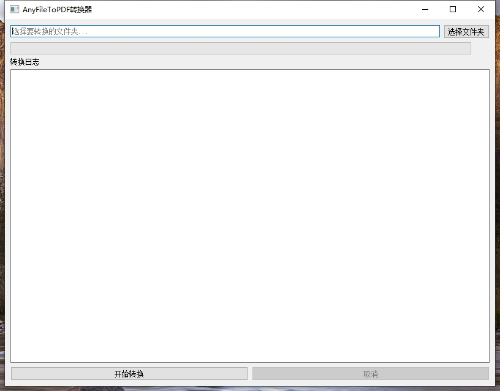

# AnyFileToPDF


一个强大的文件转换工具，可以将各种格式的文件批量转换为PDF格式。支持文档、表格、演示文稿、图片等多种文件格式，提供直观的图形用户界面和详细的转换日志。



## ✨ 特性

- 🚀 支持批量转换文件夹及其子文件夹中的文件
- 📄 支持多种文件格式：
  - 文档：`.docx`, `.doc`, `.txt`, `.rtf`
  - 表格：`.xlsx`, `.xls`
  - 演示：`.pptx`, `.ppt`
  - 图片：`.jpg`, `.png`, `.gif`, `.bmp`
  - 网页：`.html`, `.htm`
- 🎯 智能编码检测，自动处理中文编码问题
- 📊 实时转换进度显示
- 📝 详细的转换日志
- 🎨 美观的图形用户界面
- 💡 智能错误处理和异常恢复

## 🔧 安装要求

- Windows 操作系统
- Python 3.8+
- 依赖包：
  ```
  PyQt5>=5.15.0
  reportlab>=4.0.0
  Pillow>=9.0.0
  python-docx>=0.8.11
  openpyxl>=3.0.9
  python-pptx>=0.6.21
  chardet>=4.0.0
  pyinstaller>=5.0.0
  tqdm>=4.65.0
  ```

## 🚀 快速开始

1. 克隆仓库：
   ```bash
   git clone https://github.com/Tianyuyuyuyuyuyu/TechTreasury.git
   cd TechTreasury/AnyFileToPDF
   ```

2. 安装依赖：
   ```bash
   pip install -r requirements.txt
   ```

3. 运行程序：
   ```bash
   python main.py
   ```

## 📖 使用说明

1. 启动程序后，点击"选择文件夹"按钮选择要转换的文件夹
2. 程序会自动扫描文件夹及其子文件夹中的所有可转换文件
3. 点击"开始转换"按钮开始转换过程
4. 转换后的PDF文件将保存在源文件夹下的 `outputsPDF` 目录中
5. 转换过程中可以查看实时进度和日志信息
6. 如需取消转换，点击"取消"按钮

## 🔍 注意事项

- 转换后的PDF文件将保存在源文件夹下的 `outputsPDF` 目录中
- 程序会自动跳过已经是PDF格式的文件
- 对于不支持直接转换的文件类型，程序会尝试以文本方式读取并转换
- 建议在转换大量文件前先进行小规模测试

## 🐛 问题反馈

如果您在使用过程中遇到任何问题，或有任何建议，欢迎通过以下方式反馈：

- 在 [GitHub Issues](https://github.com/Tianyuyuyuyuyuyu/TechTreasury/issues) 提交问题
- 发送邮件至：tianyulovecars@gmail.com

## 📄 许可证

本项目采用 MIT 许可证。详见 [LICENSE](LICENSE) 文件。

## 👨‍💻 作者

**TianYu**

- 📧 Email: tianyulovecars@gmail.com
- 🌐 GitHub: [@Tianyuyuyuyuyuyu](https://github.com/Tianyuyuyuyuyuyu/TechTreasury)

## 🙏 鸣谢

感谢以下开源项目：

- [PyQt5](https://www.riverbankcomputing.com/software/pyqt/)
- [ReportLab](https://www.reportlab.com/)
- [python-docx](https://python-docx.readthedocs.io/)
- [openpyxl](https://openpyxl.readthedocs.io/)
- [Pillow](https://python-pillow.org/) 