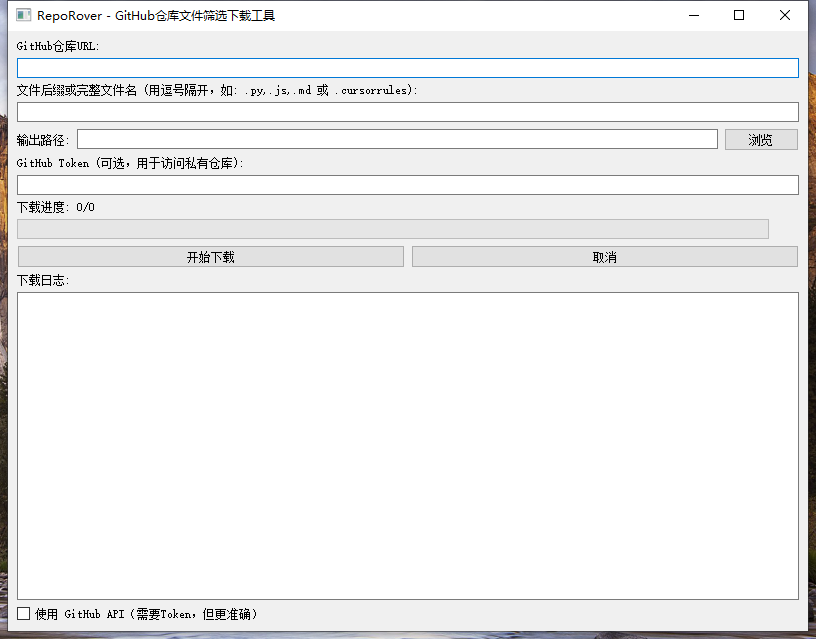

# RepoRover

[](LICENSE)
[](https://www.python.org/)
[](https://pypi.org/project/PyQt5/)

RepoRover 是一个强大的 GitHub仓库文件筛选下载工具，它允许用户根据文件后缀或完整文件名从任意 GitHub 仓库中批量下载文件。

## 界面预览



## 特性

- 🔍 支持按文件后缀或完整文件名筛选
- 📂 支持递归扫描仓库所有目录
- 🚀 支持网页解析和 GitHub API 两种下载模式
- 💫 美观的图形用户界面
- 📊 实时下载进度显示
- 📝 详细的下载日志
- 🔒 支持私有仓库访问（需要 GitHub Token）
- 🔄 自动处理文件名冲突

## 安装

### 依赖项

- Python 3.6+
- PyQt5
- requests
- beautifulsoup4
- PyGithub

### 安装步骤

1. 克隆仓库：
```bash
git clone https://github.com/Tianyuyuyuyuyuyu/TechTreasury.git
cd TechTreasury
```

2. 安装依赖：
```bash
pip install -r requirements.txt
```

## 使用方法

1. 运行程序：
```bash
python main.py
```

2. 在界面中填写以下信息：
   - GitHub 仓库 URL（支持 HTTPS 和 SSH 格式）
   - 文件后缀或完整文件名（用逗号分隔）
   - 输出路径
   - GitHub Token（可选，用于访问私有仓库）

3. 选择下载模式：
   - 网页解析模式（默认）：无需 Token，适用于大多数场景
   - GitHub API 模式：需要 Token，但更准确和稳定

4. 点击"开始下载"按钮开始下载

## 功能说明

### 文件匹配规则

- 支持多种匹配模式：
  - 文件后缀（例如：.py, .js, .md）
  - 完整文件名（例如：.gitignore, README.md）
  - 不区分大小写匹配

### 文件命名规则

- 自动处理同名文件
- 为重复文件名添加数字后缀
- 保持原始文件扩展名

### 下载控制

- 实时显示下载进度
- 可随时取消下载
- 自动处理网络错误
- 支持断点续传

## 注意事项

1. 使用 GitHub API 模式时需要注意 API 访问限制
2. 下载大量文件时建议使用网页解析模式
3. 私有仓库访问需要具有适当权限的 GitHub Token
4. 建议在稳定的网络环境下使用

## 贡献

欢迎提交 Issue 和 Pull Request！

## 作者

**TianYu**

- Email: tianyulovecars@gmail.com
- GitHub: [@Tianyuyuyuyuyuyu](https://github.com/Tianyuyuyuyuyuyu)
- Homepage: [TechTreasury](https://github.com/Tianyuyuyuyuyuyu/TechTreasury)

## 许可证

本项目采用 MIT 许可证 - 详见 [LICENSE](LICENSE) 文件 